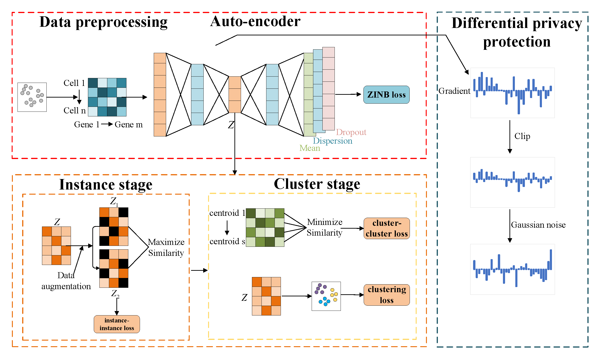

# DP-DCAN: Differentially Private Deep Contrastive Autoencoder Network for Single-cell Clustering

Single-cell RNA sequencing (scRNA-seq) is important to transcriptomic analysis of gene expression. Recently, deep learning has facilitated the analysis of high-dimensional single-cell data. Unfortunately, deep learning models may leak sensitive information about users. As a result, Differential Privacy (DP) is increasingly being used to protect privacy. However, existing DP methods usually perturb whole neural networks to achieve differential privacy, and hence result in great performance overheads. To address this challenge, in this paper, we take advantage of the uniqueness of the autoencoder that it outputs only the dimension-reduced vector in the middle of the network, and design a Differentially Private Deep Contrastive Autoencoder Network (DP-DCAN) by partial network perturbation for single-cell clustering. Firstly, we use contrastive learning to enhance the feature extraction of the autoencoder. And then, since only partial network is added with noise, the performance improvement is obvious and twofold: one part of network is trained with less noise due to a bigger privacy budget, and the other part is trained without any noise. Experimental results of 8 datasets have verified that DP-DCAN is superior to the traditional DP scheme with whole network perturbation.


## install

### python
`python=3.9.13`

### pip
```
$ pip install -r requirements
```

## Usage

You can run the DP-DCAN from the command line:
```
python DP_DCAN_main.py --data_file 'Muraro.h5' --experiment_name 'dp-1' --sigma 0.0 --z_dim 32 --select_genes 2000 --n_clusters 9 --pretrain_epochs 50 \
      --fit_epochs 40  --batch_size 210 --c1_dropout 0.2 --c2_dropout 0.2 --alpha 0.8 --beta1 0.4 --beta2 0.4 --beta3 0.2 --l2_norm_clip 0.1 \
      --noise_multiplier 3.46 --steps_dp 842 --device 'cpu'
```

## Citation

```
@inproceedings{li2024dp,
  title={DP-DCAN: Differentially Private Deep Contrastive Autoencoder Network for Single-Cell Clustering},
  author={Li, Huifa and Fu, Jie and Chen, Zhili and Yang, Xiaomin and Liu, Haitao and Ling, Xinpeng},
  booktitle={International Conference on Intelligent Computing},
  pages={380--392},
  year={2024},
  organization={Springer}
}
```
